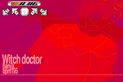

# piugba

This is a PIU emulator for the GBA that uses [StepMania](https://github.com/stepmania/stepmania) SSC charts.

⚠️ Under development ⚠️



## Key features

- Full **.ssc files** support, including:
  * Normal, hold and fake notes
  * BPM changes
  * Scroll speed changes
  * Stops/Delays and async-stops
  * Warps and fast-BPM warps
- **Speed multiplier** can be changed in-game
- **BGA DARK** mode with blink effect
- **Song selector** with names, backgrounds and sound previews
- **Optimized** to support ~60 songs per ROM file.

## How does it work?

A node.js script (the **importer**) converts a list of SSC/MP3/PNG files into binary files which the GBA can understand. For audio, it uses GSM audio files which are very small in size.

Charts are converted into a format created for this project called **PIUS**. Then everything is bundled in a **GBFS** file (a filesystem created by the GBA scene) and appended to the final ROM.

[See the wiki](https://github.com/rodri042/piugba/wiki) for more details!

## How to a build a ROM

- Install everything (read the section below).
- Create in `src/data/content` one folder per song, including:
  - one `.ssc` file with the charts
  - one `.mp3` file with the song
  - one `.png` file with the background
- Put your theme in `src/data/assets` (⚠️ TODO: Provide a default theme & update docs ⚠️)
- Run:
```bash
make import MODE=auto
make assets
make build ENV=production
make package
```

## Install

### Windows

- Use this file structure in `D:\work\gba`:
	* `gba`
		* `tools`
			* `devkitPro`
		* `projects`
			* `piugba`
- Install the toolchain:
  * [VSCode](https://code.visualstudio.com): The IDE
  * [Git Bash](https://gitforwindows.org): The console
  * [devkitPro](https://github.com/devkitPro/installer/releases): The devkit for compiling GBA roms. It comes with:
    * *grit*: Used to convert paletted bitmaps to C arrays or raw binary files
    * *gbfs*: Used to create a package with all the game assets
  * [node.js >= 10](https://nodejs.org/en): The JS runtime
  * [make](scripts/toolchain/programs/make-3.81.zip): The build automation tool
  * [ImageMagick](scripts/toolchain/programs/ImageMagick-7.0.10-3-Q16-x64-static.exe): The tool used to convert images to paletted bitmaps
  * [pngfix](scripts/toolchain/programs/pngfix.exe): A small command line util to fix corrupted PNG files.
  * [ffmpeg *(with libgsm)*](scripts/toolchain/programs/ffmpeg-3.3.3-win64-static.zip): The tool used to convert audio files to PCM
    * To avoid using the `ffmpeg.exe` binary included with *ImageMagick*, add it to `PATH` first!
- Add to `~/.bash_profile`:
```bash
export PATH=$PATH:/d/work/gba/tools/devkitPro/bin
export PATH=$PATH:/d/work/gba/tools/devkitPro/devkitARM/bin
export PATH=$PATH:/d/work/gba/tools/devkitPro/tools/bin
```
- You can check if the tools are installed correctly running `./scripts/toolchain/check.sh`

### VSCode

- Recommended plugins: `C/C++ Extensions`, `EditorConfig`, `Prettier - Code formatter`
- Recommended settings: [here](scripts/toolchain/vscode_settings.json)

## Actions

### Commands

- `make clean`: Cleans build artifacts
- `make assets`: Compiles the needed assets in `src/data/content/_compiled_sprites` (required for compiling)
- `make build`: Compiles and generates a `.gba` file without data
- `make import`: Imports the songs from `src/data/content/songs` to a GBFS file
- `make package`: Compiles and appends the GBFS file to the ROM
- `make start`: Starts the compiled ROM
- `make restart`: Recompiles and starts the ROM

#### Parameters

Name | Values | Description
--- | --- | ---
`MODE` | **`manual`** or `auto` | When using `auto`, the import process is not interactive anymore and tries to guess the missing data (e.g. difficulty levels).
`ENV` | **`development`**, or `debug` or `production` |`debug`: backgrounds are disabled, stage-break is OFF and a *180ms* audio lag correction is added for the **mGBA** emulator.<br><br> `development`: the same, but including backgrounds.<br><br>`production`: backgrounds, stage-break ON and no audio lag corrections.

### Scripts

#### Build sprites

```bash
# use #FF00FF as transparency color
grit *.bmp -ftc -pS -gB8 -gT ff00ff -O shared_palette.c
```

#### Build backgrounds

```bash
magick file.png -resize 240x160\! -colors 255 file.bmp
grit file.bmp -gt -gB8 -mRtf -mLs -ftb
```

#### Build music

```bash
ffmpeg -y -i file.mp3 -ac 1 -af 'aresample=18157' -strict unofficial -c:a gsm file.gsm
ffplay -ar 18157 file.gsm
```

#### Build filesystem

```bash
gbfs files.gbfs *.pius *.gsm *.bin
# pad rom.gba to a 256-byte boundary
cat rom.gba files.gbfs > rom.out.gba
```

#### Build gba-sprite-engine

```bash
rm -rf cmake-build-debug ; mkdir cmake-build-debug ; cd cmake-build-debug ; cmake ./../ -G "Unix Makefiles" ; make ; cp engine/libgba-sprite-engine.a ../../piugba/libs/libgba-sprite-engine/lib/libgba-sprite-engine.a ; cd ../
```

### Troubleshooting

#### Undefined reference to *function name*

If you've added new folders, check if they're in `Makefile`'s `SRCDIRS` list!

## Open-source projects involved

- [wgroeneveld/gba-sprite-engine](https://github.com/wgroeneveld/gba-sprite-engine): Dec 18, 2019
  * Forked at: [rodri042/gba-sprite-engine](https://github.com/rodri042/gba-sprite-engine)
- [pinobatch/gsmplayer-gba](https://github.com/pinobatch/gsmplayer-gba): Feb 9, 2020
